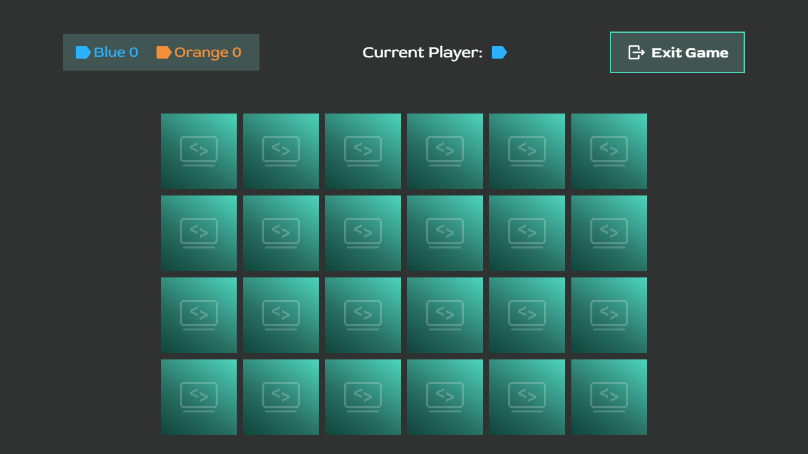

# Memory Game

A browser-based memory card game built with **TypeScript**, **SCSS**, and **Vite**.

The project focuses on modular frontend architecture, type-safe logic, and interactive gameplay.

---

## Live Demo

[Play the game](https://memory.dominik-troendle.de)

---

## Features

* Multiple **themes** with dynamic styling and preview
* Configurable **board sizes**
* Two-player mode with **turn-based logic**
* **Score tracking** with persistent session storage
* Animated **card flipping and matching**
* Endscreen with **winner/draw detection**
* Overlay system for **pause / exit handling**

---

## Tech Stack

* **TypeScript** – type-safe application logic
* **SCSS** – modular and maintainable styling
* **Vite** – fast development environment
* **HTML5** – semantic structure
* **Session Storage API** – state persistence between pages

---

## Getting Started

### Prerequisites

* Node.js
* npm

### Installation

```bash
npm install
```

### Run development server

```bash
npm run dev
```

### Preview production build

```bash
npm run preview
```

---

## Game Flow

1. Select:

   * Theme
   * Starting player
   * Board size
2. Start the game
3. Players take turns flipping cards:

   * Match → score point + continue turn
   * No match → cards reset + switch player
4. Game ends when all pairs are found
5. Final scores and winner are displayed

---

## Project Structure

```
src/
├── config/        # Static configuration (themes, assets)
├── pages/         # Page-specific structure (settings, game, endscreen)
├── scripts/       # Page-specific logic (settings, game, endscreen)
├── styles/        # SCSS structure
├── types/         # TypeScript interfaces
├── utils/         # Helper functions (DOM utilities)
```

---

## Configuration

Game settings are stored in `sessionStorage`:

```ts
{
  theme: string,
  player: string,
  boardSize: number
}
```

Scores are also persisted during navigation:

* `scoreBlue`
* `scoreOrange`

---

## Key Concepts

* **State-driven rendering** via a central `cards` array
* Separation of:

  * UI logic
  * game logic
  * configuration
* Controlled DOM access via utility helpers
* Type-safe validation using TypeScript (e.g. custom type guards)

---

## Preview

